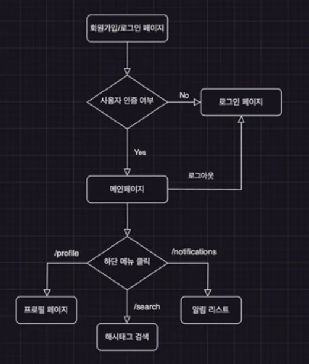

# prac-twitter-clone

## 목적

- React 앱의 구조와 라우팅을 이해
- Firebase의 심화 개념을 익히고 실시간 데이터 처리와 이미지 업로드를 실습함.
- Firebase의 OAuth를 이용한 SNS 로그인 구현을 적용함.
- 전역 상태 관리의 필요성과 recoil 사용법 이해
- 미디어 쿼리 및 scss 개념을 알아보고 직접 스타일링을 적용함.
    - scss와 css의 차이점과 반응형 웹은 어떻게 구현해야 되는지에 대해서 알아보기
- Vercel을 이용해 배포

## 사용하는 기술

- react를 이용한 프로젝트 세팅 → create-react-app
- React-router-dom으로 라우팅
- Firebase auth를 이용한 SNS 회원가입 / 로그인
- Firebase Firestore과 onSnapshot을 이용한 실시간 게시판 CRUD
- Media Query 및 SCSS를 이용한 반응형 스타일링
- Recoil을 이용한 상태관리 (메뉴 다국어 처리)
- Vercel CLI로 배포

## 프로젝트 설계
